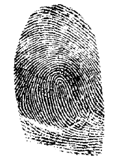

# 🎨 Gerador de Identicons

A motivação para este projeto surgiu enquanto eu buscava uma foto de perfil padronizada para meu GitHub e WakaTime. Identicons fornecem uma identidade visual única e consistente sem a necessidade de uma imagem real.

## O que é um Identicon?



Um identicon é uma imagem que representa visualmente uma identidade única. Eles são gerados a partir de dados específicos, como um texto ou um endereço IP, utilizando uma função de hash. Este conceito foi originalmente inventado por Don Park como uma maneira de representar visualmente endereços IP sem revelar o endereço real, proporcionando uma camada adicional de privacidade. 

Identicons podem ser usados em diversas situações para identificar visualmente usuários ou itens de forma única e fácil de reconhecer, sem expor informações sensíveis. Por exemplo, eles podem ser usados em páginas wiki para identificar autores ou em sistemas CRM para identificar clientes.

Aqui está um exemplo de um identicon gerado a partir da palavra "identicon":


## Tecnologias Utilizadas

- **Next.js**: Framework React para renderização do lado do servidor e geração de sites estáticos.
- **Tailwind CSS**: Framework CSS utilitário para estilização rápida e responsiva.
- **ethereum-blockies**: Biblioteca para geração de identicons visualmente consistentes.

## Como Funciona

1. Digite um texto no campo de entrada.
2. O identicon será gerado automaticamente e exibido na tela.
3. Clique no botão "Baixar Imagem" para salvar a imagem em alta resolução.

## Como Executar o Projeto

1. Navegue até o diretório do projeto:
```bash
cd identicons
```

2. Instale as dependências:
```bash
pnpm install
```

3. Execute o projeto:
```bash
pnpm dev
```

4. Abra o navegador e acesse [http://localhost:3000](http://localhost:3000) para ver o projeto funcionando.
